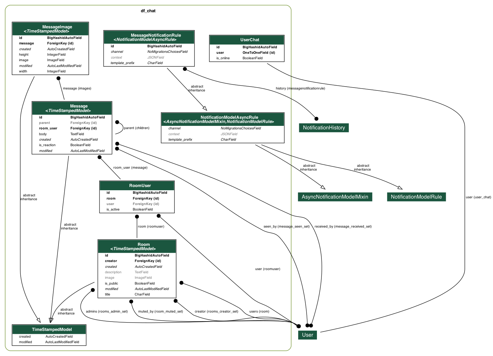

# Djangoflow Chat

Opinionated Django Chat

## Design

...

## Principles

* **Opinionated:** Create a set of strict guidelines to be followed by the users and developers. Well defined and consistent guidelines reduce errors and unwanted side-effects. The framework should be easy to understand, implement, and maintain.

* **Secure:** Follow the industry best practices for secure software development, communications, storage, as well as long-term maintenance. Always evaluate the risks and trade-offs in appropriate contexts.

* **Clean code:** Strictly follow the DRY (Don't Repeat Yourself) principle; write your code for other developers to understand; document and keep the documentation updated; automate testing your code, packaging, deployments, and other processes; discuss your ideas before implementing unless you are absolutely sure; be a good craftsman.

* **Open:** Offer source code and related artifacts under open source licenses. Build and manage a collaborative community where everyone is welcome.

* **Configurable:** Provide ways to change behavior, appearance, and offer extension points everywhere possible.

* **Reuse:** Do not reinvent the wheel. Use existing high-quality modules as much as possible.

## Endpoints

* `chat/`
# TODO: specify endpoints

## Data model



## Views and templates

...

## Development

### Running test application.

Here you can check admin and API endpoints.

```bash
python3 -m venv venv
. venv/bin/activate
pip install -r requirements.txt
./manage.py migrate
./manage.py runserver
